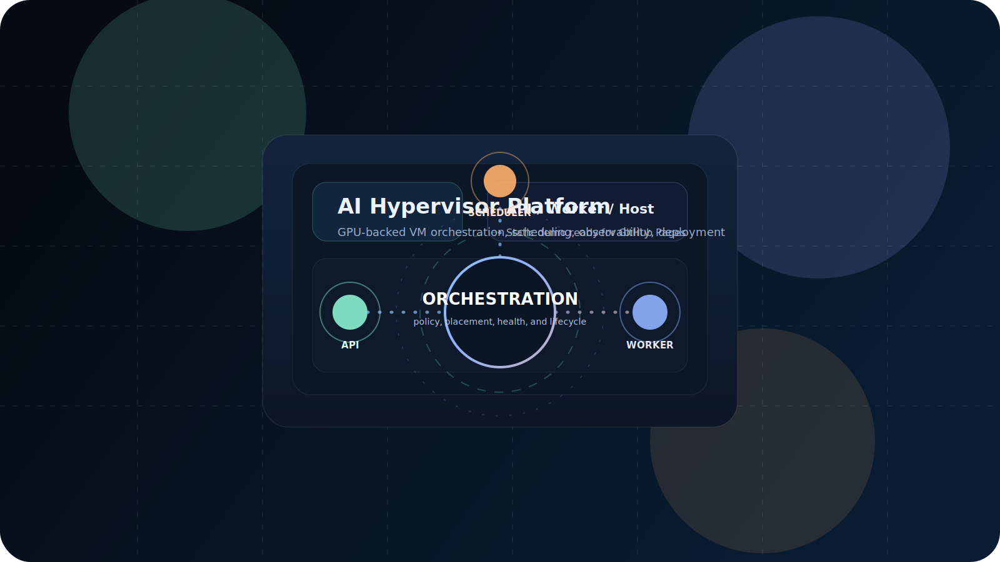
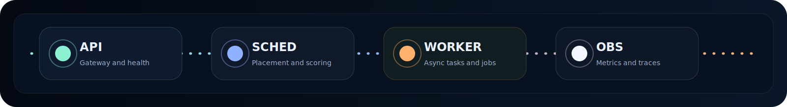
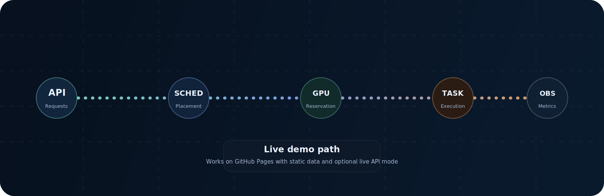

# AI Hypervisor Platform

AI Hypervisor Platform is an opinionated, production-grade virtualization control plane focused on GPU-accelerated AI workloads. It combines secure VM lifecycle management, intelligent GPU orchestration, and a robust observability stack to run inference services at scale.

This repository contains the control plane components, integrations, and deployment artifacts for operating heterogeneous GPU clusters with KVM/QEMU-backed VMs and Kubernetes-native operations.

The repository also includes a static GitHub Pages frontend under `docs/site` and GitHub Actions workflows for publishing container images to GHCR.
The primary published images follow the repo-role naming pattern: `ai-hypervisor-platform-api` and `ai-hypervisor-platform-worker`.

<p align="center">
	
</p>

<p align="center">
  
</p>

## Motion previews




The GitHub Pages site is designed to work in two modes:

- Static demo mode with local sample data and animated SVGs.
- Live mode when you append `?api=https://your-api.example.com` to the Pages URL.

---

**Contents (high level)**
- `cmd/` – Service entry points (API, VM manager, GPU orchestrator, resource monitor, host agent).
- `internal/` – Core implementation packages and integrations.
- `pkg/` – Reusable public packages (telemetry, errors, common utilities).
- `deploy/` – Kubernetes manifests, Helm charts, and provisioning scripts.
- `docs/` – Architecture and operations documentation.
- `docs/site/` – Modern static frontend published to GitHub Pages.
- `docs/site/animations/` – Animated SVG assets used by the README and Pages demo.

---

**Project Overview**

AI Hypervisor Platform provides service operators with a unified control plane to provision, schedule, and observe virtual machines tailored for GPU workloads. The system targets production environments that require strict isolation, reproducible VM images, GPU sharing and partitioning (MIG), and end-to-end telemetry for SLO-driven operations.

Core principles:
- Resilient service orchestration with observable health and traces.
- Deterministic GPU allocation policies with fairness and performance controls.
- Minimal host dependencies: Libvirt + NVML for node-level telemetry and control.

---

**Architecture Explanation**

The platform is composed of modular services that communicate via NATS and coordinate using PostgreSQL and Redis as authoritative stores:

- `api-server` – External API, authentication, and UI ingress. Exposes REST and WebSocket endpoints.
- `vm-manager` – VM lifecycle orchestration; issues libvirt commands via Host Agents.
- `gpu-orchestrator` – Allocation engine for GPUs (bin-packing, spread, NUMA-aware heuristics).
- `scheduler` – Pluggable scheduler that applies policy and scoring across hosts.
- `task-executor` – Reliable, async execution of long-running tasks.
- `resource-monitor` – Aggregates VM and GPU metrics, runs background collectors, and forwards metrics to Prometheus/OpenTelemetry.
- `host-agent` – Daemonset on each node that interacts with libvirt and NVML; reports local metrics and executes host-level commands.

Communication and data flows:
- Control messages: NATS subjects and request/reply patterns for low-latency commands.
- Persistent state: PostgreSQL for authoritative VM and allocation state; Redis for ephemeral caches and leader election.
- Observability: Prometheus scrape endpoints + OTLP traces for distributed tracing.

Architecture diagram placeholders (replace with rendered diagrams in `/docs/diagrams/`):

- [Diagram: High-level system components and message flows](docs/diagrams/high-level-architecture.png)
- [Diagram: Host-level components (libvirt, NVML, host-agent)](docs/diagrams/host-agent-architecture.png)
- [Diagram: Metrics & tracing pipeline (OTLP -> Collector -> Prometheus/Grafana)](docs/diagrams/observability-pipeline.png)

---

**Infrastructure Stack**

- Language: Go 1.21
- Messaging: NATS
- Datastore: PostgreSQL (primary), Redis (caching/coordination)
- Container orchestration: Kubernetes (manifests & Helm charts included)
- Virtualization: KVM/QEMU via Libvirt
- GPU telemetry: NVML (NVIDIA), vendor-specific tools for AMD/Intel
- Observability: Prometheus, Grafana, OpenTelemetry (OTLP)

---

**Virtualization Workflow**

1. User/API requests VM creation with resource and GPU requirements.
2. `vm-manager` validates request and writes a desired-state record to PostgreSQL.
3. `scheduler` selects a candidate host, scoring nodes by available CPU/memory/GPU.
4. `gpu-orchestrator` reserves GPU resources (MIG-aware when enabled) and updates allocation records.
5. `task-executor` enqueues provisioning tasks which `host-agent` consumes to invoke Libvirt.
6. `host-agent` executes domain creation, configures vNICs, and reports back via NATS.
7. `resource-monitor` collects runtime metrics and emits them to Prometheus/Grafana and OTLP traces for requests.

---

**GPU Orchestration Explanation**

The GPU Orchestrator implements configurable allocation strategies:

- Bin-packing: fill hosts to maximize utilization.
- Spread: distribute load to reduce scheduling hotspots.
- NUMA-aware: prefer GPUs local to the CPU NUMA domain when requested.

It supports:
- Affinity labels and CUDA capability filters.
- MIG-based slicing for supported NVIDIA hardware.
- Health checks and automated reclamation for faulty devices.

Operators can tune allocation policies via `config/sample-config.yaml`.

---

**Observability Overview**

This project provides a unified observability approach:

- Metrics: Prometheus client instrumentation exposed on a dedicated port (configurable). Metrics include request rates, VM lifecycle counters, host resource gauges, and GPU utilization metrics.
- Tracing: OpenTelemetry (OTLP) integrated for distributed traces; spans are created at API and long-running task boundaries.
- Logging: Structured JSON logs (logrus) with correlation fields such as `request_id` and `trace_id`.
- Dashboards: Grafana provisioning with dashboards for cluster overview, GPU utilization, and VM lifecycle monitoring (files under `deploy/grafana/`).

Background collectors
- The repository includes a reusable `internal/collectors` package and demo `cmd/resource-monitor` and `cmd/host-agent` mains that start background collectors. Replace the synthetic fetchers with platform-specific implementations (libvirt, NVML, nvidia-smi) to collect live metrics.

---

**Deployment Instructions**

1. Configure infrastructure (Postgres, Redis, NATS) in your cluster or use the included Helm charts.
2. Edit `config/sample-config.yaml` to match your environment (networking, metrics ports, GPU policies).
3. Build binaries or container images for the services:

```bash
go mod download
go build -o bin/api-server ./cmd/api-server
go build -o bin/resource-monitor ./cmd/resource-monitor
go build -o bin/host-agent ./cmd/host-agent
```

4. Deploy to Kubernetes:

```bash
kubectl apply -f deploy/kubernetes/manifests.yaml
```

5. Verify metrics and dashboards:

```bash
kubectl -n monitoring port-forward svc/prometheus 9090:9090
kubectl -n monitoring port-forward svc/grafana 3000:3000
```

6. (Optional) Configure OTLP endpoint and install an OpenTelemetry Collector for richer exporting.

7. Publish the Pages frontend and container images. GitHub Actions handles both of
	these automatically on pushes to main; open the Pages site and append
	`?api=https://your-api.example.com` to connect the dashboard to a live API.

GitHub Pages demo URL:

- `https://DARREN-2000.github.io/ai-hypervisor-platform/`

---

**API Overview**

The API exposes REST endpoints under `/api/v1` for VM, GPU, host, and task management. Key endpoints:

- `POST /api/v1/vms` – Request VM creation
- `GET /api/v1/vms` – List VMs and their status
- `GET /api/v1/hosts` – Query host inventory and capacities
- `GET /metrics` – Prometheus metrics endpoint (service-specific)
- Health endpoints: `/health`, `/ready`, `/live`

See `docs/api/openapi.yaml` for the full API specification and schema.

---

**Roadmap**

- ✅ Core VM orchestration and scheduler
- ✅ GPU allocation primitives and monitoring
- ✅ Observability: Prometheus + OTLP traces
- [ ] Live VM migration
- [ ] Multi-cluster federation and cross-region scheduling
- [ ] ML-driven scheduler recommendations
- [ ] Advanced GPU virtualization features (fine-grained MIG profiles)

---

If you want me to also wire the synthetic collectors to a real libvirt/NVML implementation in `cmd/host-agent` or add concrete Grafana panels for the collector metric names, tell me which service to target and I will implement the integration.

---

For more details see the architecture notes in `ARCHITECTURE.md` and operational runbooks in `docs/operations/`.
