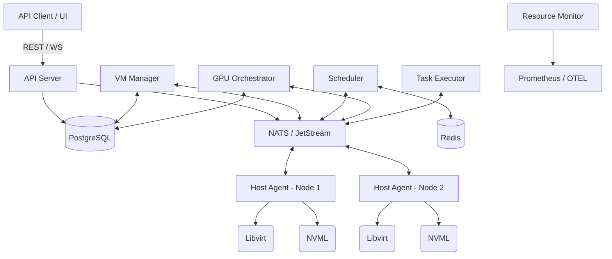

# System Architecture

The AI Hypervisor Platform is designed as a distributed, event-driven control plane for virtual machines on bare-metal GPU nodes.

## Component Overview

### API Server (`api-server`)
The entry point for all external communication. Handles REST API requests, authentication, and WebSocket streams for real-time telemetry.

### VM Manager (`vm-manager`)
The orchestrator for VM lifecycle events. It translates user requests into internal state changes and dispatches tasks to the Host Agents.

### Scheduler (`scheduler`)
Evaluates the cluster state and determines the optimal host placement for new VMs based on resource requirements, GPU constraints (like NUMA affinity), and configured policies (spread vs. bin-packing).

### GPU Orchestrator (`gpu-orchestrator`)
Manages the lifecycle and allocation of GPU resources. It tracks available capacity, health, and handles advanced features like Multi-Instance GPU (MIG) partitioning.

### Resource Monitor (`resource-monitor`)
Aggregates metrics from all nodes. It scrapes data from Host Agents and exposes a unified Prometheus endpoint and OpenTelemetry traces.

### Host Agent (`host-agent`)
A daemon running on every bare-metal node. It interacts directly with Libvirt (for KVM/QEMU control) and NVML (for NVIDIA GPU management). It executes the actual creation, deletion, and monitoring of domains.

### Task Executor (`task-executor`)
Handles asynchronous, long-running operations. It pulls tasks from NATS JetStream and ensures they run to completion, updating state in PostgreSQL.

## Data Flow & State Management

1.  **Authoritative State**: PostgreSQL is the source of truth for desired state (VM configurations, cluster topology, RBAC).
2.  **Ephemeral State/Caching**: Redis is used for fast lookups, distributed locking, and caching active allocations.
3.  **Messaging**: NATS is the central nervous system.
    *   **Core NATS**: Used for low-latency RPCs (e.g., synchronous scheduler requests).
    *   **JetStream**: Used for reliable task queues and event streaming (e.g., VM state changes).

## Mermaid Diagram

## Scaling Model

The platform is designed to scale horizontally:
- `api-server`, `scheduler`, and `gpu-orchestrator` can be replicated behind a load balancer.
- State is maintained in external, scalable datastores (Postgres, Redis).
- `host-agent` scales linearly with the number of physical nodes.